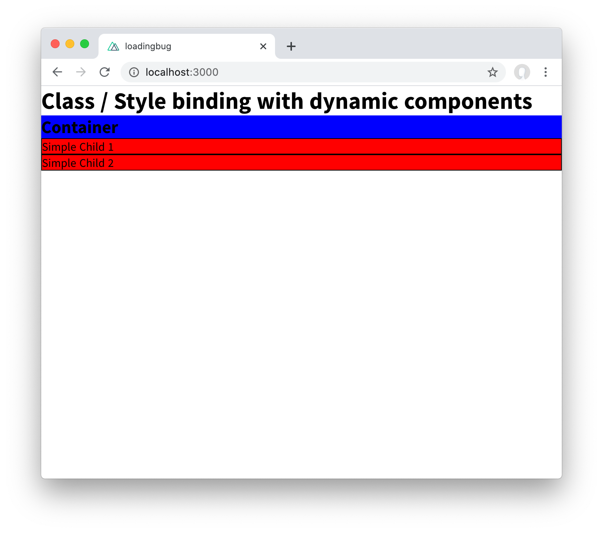

# dynamic components ssr bug

The server side rendered html is missing class and style attributes set on parent
component for dynamically imported children.

This is how it should look like: 

This is how how the server side rendered html looks like: 

## possible workarounds

- avoiding async imports via manual registering the components in a plugin
- wrapping the DynamicComponent within a div
- using `:key` inside DynamicComponent

## Build Setup

```bash
# install dependencies
$ npm install

# serve with hot reload at localhost:3000
$ npm run dev

# build for production and launch server
$ npm run build
$ npm run start

# generate static project
$ npm run generate
```

For detailed explanation on how things work, check out [Nuxt.js docs](https://nuxtjs.org).
